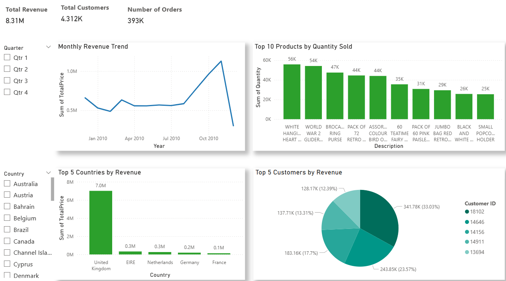

# 📊 Online Retail Analysis Dashboard

## Problem Statement
Retail businesses need to identify revenue patterns, top-performing products, and high-value customers to make data-driven decisions.  
Raw transactional data is messy — duplicates, missing values, and invalid entries make it hard to analyze directly.

## 📊 Dashboard Preview
Here is the Power BI dashboard built for Online Retail Analysis:

## Data Preparation
- Cleaned **Online Retail II dataset** in Jupyter Notebook:
  - Removed duplicates & null values
  - Handled negative quantities & invalid prices
  - Created new columns: `TotalPrice`, `MonthYear`
- Exported a **clean CSV** as the single source of truth
- Imported into **Power BI** for analysis

## Dashboard Overview
**KPIs:**
- Total Revenue: 8.31M
- Total Customers: 4.312K
- Number of Orders: 392K

**Visuals:**
- **Monthly Revenue Trend** (line chart, quarter/year slicer)
- **Top 10 Products by Quantity Sold** (bar chart → popularity)
- **Top 5 Countries by Revenue** (bar chart → business value)
- **Top 5 Customers by Revenue** (pie chart with clean color scheme)

**Slicers:**
- Quarter (filter revenue trends)
- Country (filter all charts by geography)

## Key Insights
- **Seasonality:** Clear revenue peaks around end of year (holiday season).  
- **Geography:** United Kingdom dominates revenue, followed by a few European countries.  
- **Products:** High-volume “gift” items (like hangers & gliders) dominate by sales quantity.  
- **Customers:** A small group of customers drives a significant share of total revenue.

## Business Value
- **Executives** can track high-level KPIs at a glance.  
- **Sales teams** can focus on top customers for retention programs.  
- **Operations** can optimize stock levels for popular products.  
- **Strategy teams** can identify key markets for expansion.  

---

📌 Built with **Python (data prep)** + **Power BI (dashboard)**.  
